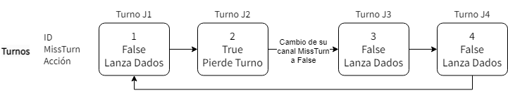
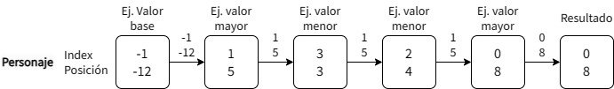

# TA3 Modified Ludo
Ludo modificado en lenguaje GO para el curso de programación Concurrente y Distribuída.

## Integrantes
* Anto Chávez, Carolain
* Maguiña Bernuy, Richard José
* Atarama Leon, Diego Sebastian

## Desarrollo del Juego
### Elementos
#### Tablero
* Está dividido en casillas.
* Cada **casilla** puede tener caminos u obstáculos.
* Los **obstáculos** pueden ser paredes, trampas o criaturas que bloquean el paso de los personajes.
* Para ello se usa un tipo de dato BoardSquare (simulando un enum) que indicará si es camino libre (PATH) o qué obtáculo tiene.
  ```
  type BoardSquare uint8
  const (
   PATH     BoardSquare = 0
   WALL     BoardSquare = 1
   TRAP     BoardSquare = 2
   CREATURE BoardSquare = 3
  )
  //...
  board []BoardSquare
  ```
* La creación **obstáculos** se realiza de forma aleatoria en base al número definido para el juego.
  ```
  for i := 0; i < NumObstacles; i++ {
    min := len(game.board) / NumObstacles * i
    max := min + NumObstacles
    obsPos := rand.Intn(max-min) + min
    game.board[obsPos] = BoardSquare(rand.Intn(3) + 1)
  }
  ```
#### Jugadores
* Cada **jugador** tiene cuatro personajes.
* Cada **personaje** comienza en un punto de partida específico.
* Se guardará su posición en un array, usando el index del personaje como su id
  ```
  type Player struct {
   ...
   characters []int
  }
  ```
### Turnos y Movimientos
En cada turno, los jugadores:
1. Lanzan 3 dados:
  * 2 dados normales (del 1 al 6)
    ```
    dice1 := rand.Intn(6) + 1
    dice2 := rand.Intn(6) + 1
    ```
  * 1 dado con operación (sumar o restar)
    ```
    operator := rand.Intn(2) // 0 = + | 1 = -
    ```
2. Mueven solo 1 de sus personajes:
  * Debe avanzar el valor del primer dado +/- (usando el resultado del dado con operación) el valor del segundo dado.}
    ```
    if operator == 0 {
     move = dice1 + dice2
    } else {
     move = dice1 - dice2
    }
    p.characters[charIndex] = newPos
    ```
  * Si le toca avanzar hacia una casilla con obstáculo, el jugador pierde el turno y continua el siguiente jugador.
    <br/><br/><br/><br/>
    ```
    if newPos < 0 {
      ...
      fmt.Printf("Personaje %d del jugador %d regresa al inicio\n", charIndex+1, p.ID+1)
    } else if newPos >= BoardSize {
      ...
      fmt.Printf("El personaje %d del jugador %d llegó a la meta\n", charIndex+1, p.ID+1)
    } else if g.board[newPos] != PATH {
      // p.characters[charIndex] = newPos
      p.missTurn <- true
      fmt.Printf("El personaje %d del jugador %d cayó en un obstáculo, pierde el turno\n", charIndex+1, p.ID+1)
    } else {
      ...
      fmt.Printf("El jugador %d avanzó/retrocedió el personaje %d a la casilla %d\n", p.ID+1, charIndex+1, p.characters[charIndex])
    }
    ```

### Objetivo
* Llevar a los cuatro personajes desde los puntos de partida hasta la meta en el menor número de turnos posible.
 * Para ello usamos la función `NextMovement`, en la cual el jugador "analiza" el personaje ideal a desplazar.
 * En esta función hacemos uso de canales para obtener la mejor opción de personaje a mover:
   <br/><br/><br/><br/>
   ```
   bestChann := make(chan Best, NumCharacters+1)
   bestChann <- Best{-1, -12}
   ...
   for i, posChar := range p.characters {
   ...
    go func(index, position int) {
     ...
     newPos := position + move
     if newPos > 0 && newPos < BoardSize && g.board[newPos] == PATH {
      best := <-bestChann
      if newPos > best.position {
       current := Best{index, newPos}
       bestChann <- current
      }
      ...
     }
    }
   }
   ...
   best := <-bestChann
   close(bestChann)
   ```
 * De no encontrar alguno, elegirá aleatoriamente.
   ```
   if best.index == -1 {
    best.index = rand.Intn(NumCharacters)
    best.position = p.characters[best.index] + move
   }
   ```
* El primer jugador en llevar a todos sus personajes a la meta, gana.
  ```
  func isWinner(positions []int) bool {
   for _, pos := range positions {
    if pos < BoardSize {
     return false
    }
   }
   return true
  }
  ```

## Concurrencia
### Modificaciones y Uso de Canales
* Los jugadores y el tablero están representados como entidades concurrentes separadas que se comunican a través de canales.
* Cada jugador tiene su propio canal de comunicación con el tablero del juego para enviar movimientos y recibir actualizaciones del estado del juego.

## Enlace al video
https://youtu.be/lMiz4XhzDZI
